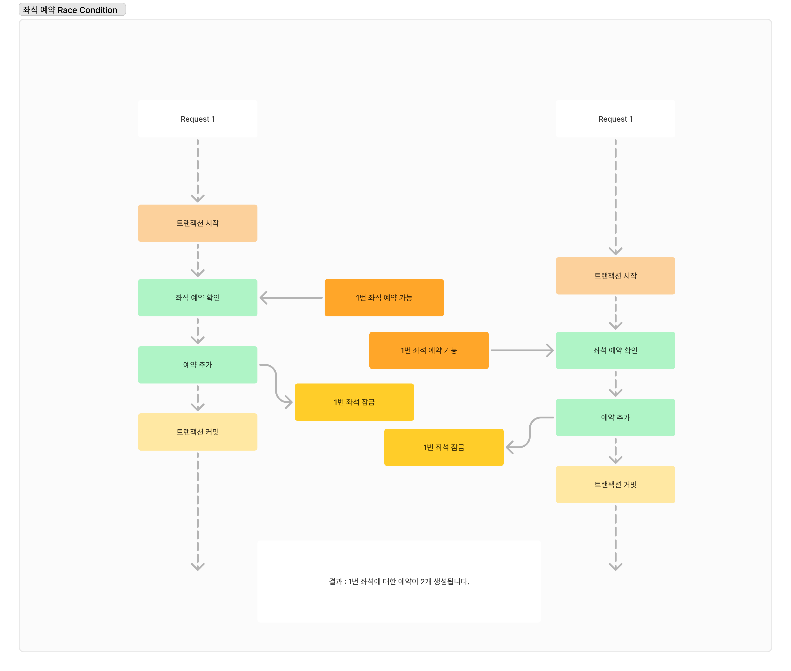

# 콘서트 예약 시스템 동시성 보고서

콘서트 예약 서비스에서 발생할 수 있는 동시성 이슈에 대해 파악하고 동시성 제어방식들에 대해서 분석해보려합니다.

## 현재 시나리오에서 발생할 수 있는 동시성 이슈

1. 좌석 선점
    
    하나의 좌석에 여러 스레드가 동시에 예약을 하려고 하는 경우 Race Condition이 발생합니다.
    



1. 유저 포인트
    
    충전 또는 사용이 동시에 호출이 일어나게 되면 분실갱신이 일어납니다.
    


## 동시성 제어 방식에 대한 이해

1. 낙관적 락
2. 데이터베이스 락
    - x-lock (배타락)
    - s-lock (공유락)
3. Redis를 이용한 분산락

### 낙관적 락

낙관적 락은 데이터에 락을 설정하지 않고, 트랜잭션 종료시점에 데이터의 변경 여부를 감지하여 충돌을 감지하는 방식입니다.


- 프로젝트 내의 구현

```java
@Getter
@Entity
@DynamicUpdate
@Table(name = "tb_user")
@NoArgsConstructor(access = AccessLevel.PROTECTED)
@Builder
@AllArgsConstructor(access = AccessLevel.PROTECTED)
public class User extends BaseEntity {

    @Id
    @GeneratedValue(strategy = GenerationType.IDENTITY)
    private Long id;

    ... 생략

    @Version
    private Long version;

    ... 생략
}
```

- 버전 어노테이션을 붙인 필드를 추가하게 되면 아래와 같이 수정시에 버전을 같이 변경하게 됩니다.


> jpa에서 버전이 불일치한 경우 `OptimisticLockingFailureException` 을 발생시킵니다. 
비즈니스 적으로 재시도 처리를 해주어야한다면 아래와 같이 구현할 수 있습니다.
> 

```java
@Transactional
@Retryable(value = {OptimisticLockingFailureException.class}, 
        maxAttempts = 3, 
        backoff = @Backoff(delay = 1000))
public UserPointResult addPoint(Long userId, BigDecimal amount) {
    User user = userService.addPoint(userId, amount);
    return UserPointResult.fromUser(user);
}
```

살펴본 바와 같이 낙관적 락은, 데이터 접근을 사전에 제한하지 않고 동작합니다. 따라서 락으로 인한 성능 저하가 없습니다.

하지만 충돌 발생시, 트랜잭션을 롤백하고, 필요시 재시도 처리를 해주어야합니다. 따라서 데이터 충돌이 자주 일어나지 않을 것이라고 예상되는 시나리오에 사용해야합니다.

반면, 비즈니스 로직상 모든 트랜잭션이 반드시 성공해야 하는 경우에는 상당한 오버헤드가 발생하게 됩니다.

예를 들어 N개의 트랜잭션을 모두 성공해야한다고 가정하면,

- 첫 번째 트랜잭션은 0번 재시도
- 두 번째 트랜잭션은 1번 재시도
- 세 번째 트랜잭션은 2번 재시도
- ...
- 마지막 트랜잭션은 `N-1`번 재시도해야합니다.

### 데이터 베이스 락

RDBMS에는 intension share lock(IS), intension exclusive lock(IX), share lock(S), exclusive lock(X) 락이 존재합니다.

IX, IS 락은 테이블 수준에서 의도 신호를 보내는 잠금으로

IS 락은 테이블의 특정 행에 대해 공유 락(S)을 설정할 것임을 나타냅니다.

IX 락은 테이블의 특정 행에 대해 배타 락(X)을 설정할 것임을 나타냅니다.

각 락의 호환성은 아래와 같습니다.


공유 락의 호환성을 살펴보면, 공유 락은 다른 공유 락과 상호 간섭하지 않습니다.  즉 , 동일한 row에 두 개 이상의 공유락을 설정하는 것이 가능합니다.


그러나 공유 락은 배타 락과는 호환되지 않습니다. 즉, 공유락이 걸려 있는 데이터에 배타 락을 결려고 하면 트랜잭션이 대기상태로 들어가게 됩니다.

여기서 주목할 점은 update문은 row에 대해서 아래와 같이 배타락을 설정한다는 점입니다. 


따라서 두 개의 트랜잭션에서 각각 공유락을 획득한 뒤, 포인트를 수정하려고 시도하는 경우 두 개의 트랜잭션 모두 대기상태에 들어가게 되고, 데드락이 발생하게 됩니다. 


따라서 공유락은 데이터를 읽는 동안 다른 트랜잭션에서 수정 작업이 발생하지 않도록 보호하는데 유용하지만, 현재 시나리오의 이슈와 같이 동시 수정이 필요한 상황에서는 적합하지 않음을 확인할 수 있었습니다.

### 배타락

배타 락은 동일한 데이터에 대해 다른 트랜잭션의 접근을 완전히 차단하며, 공유 락이나 다른 배타 락과 동일한 row에 동시에 설정될 수 없습니다. 

- 동작 원리


첫 요청의 트랜잭션이 user id 1 에 대한 배타락을 소유하고 해제할 때 까지 두번째 요청의 트랜잭션은 대기하게 됩니다. 이후 1번 트랜잭션이 완료된 이후에 2번 트랜잭션의 조회가 이루어지고, 포인트 추가가 동작하게 됩니다. 

이처럼 배타락은 데이터 무결성을 보장합니다. 포인트 충전/사용 등의 작업 동시에 발생하였을 때, 정확한 결과를 보장합니다.

그러나 배타락은 데이터에 락을 걸고 다른 트랜잭션의 대기를 유발하므로, 성능 저하가 발생할 수 있습니다.

- 프로젝트 내의 구현

```java
public Optional<User> findByIdForUpdate(Long id) {
        return Optional.ofNullable(
                jpaQueryFactory
                        .selectFrom(user)
                        .where(user.id.eq(id))
                        .setLockMode(LockModeType.PESSIMISTIC_WRITE) //select for update
                        .fetchOne()
        );
    }
```

### 분산 락

레디스의 key-value 기반의 원자성을 이용하여, 동일 키에 대한 요청을 하나씩 처리하게 합니다.

- 가장 먼저 도달한 요청으로 키를 생성

```bash
SET key value NX PX 30000  //존재하지 않을 경우에만 저장하고 30초 유지
```

- 락의 소유자가 작업을 완료한 뒤에 락을 해제 (lua script)

```bash
if redis.call("get",KEYS[1]) == ARGV[1] then //현재 락의 소유자인지 검증
    return redis.call("del",KEYS[1]) //소유자인 경우 삭제
else
    return 0 //락 해제 실패
end
```


> 반드시 락은 트랜잭션 이전에 획득하고 커밋 이후에 반납해야합니다.
> 
- 트랜잭션 이후에 락을 획득하는 경우


- 커밋 이전에 락을 반납하는 경우


- 프로젝트 내의 구현

```java
@Target(ElementType.METHOD)
@Retention(RetentionPolicy.RUNTIME)
public @interface DistributedLock { //AOP를 위한 어노테이션
    String key();
    TimeUnit timeUnit() default TimeUnit.SECONDS;
    long waitTime() default 5L;
    long leaseTime() default 3L;
}

@Aspect
@Component
@RequiredArgsConstructor
@Slf4j
@Order(Ordered.HIGHEST_PRECEDENCE)
public class DistributedLockAop {
    private static final String PREFIX = "LOCK:";

    private final RedissonClient redissonClient;
    private final AopForTransaction aopForTransaction;

    @Around("@annotation(kr.hhplus.be.server.infrastructure.redis.DistributedLock)")
    public Object lock(ProceedingJoinPoint joinPoint) throws Throwable {
        MethodSignature signature = (MethodSignature) joinPoint.getSignature();
        Method method = signature.getMethod();
        DistributedLock distributedLock = method.getAnnotation(DistributedLock.class);

        String key = PREFIX + CustomSpringELParser.getDynamicValue(signature.getParameterNames(), joinPoint.getArgs(), distributedLock.key());;
        RLock rLock = redissonClient.getLock(key);
        try {
            boolean available = rLock.tryLock(distributedLock.waitTime(), distributedLock.leaseTime(), distributedLock.timeUnit());  // (2)
            if (!available) {
                return false;
            }

            return aopForTransaction.proceed(joinPoint);
        } catch (InterruptedException e) {
            throw new InterruptedException();
        } finally {
            try {
                rLock.unlock();
            } catch (IllegalMonitorStateException e) {

                log.info("Redisson Lock Already UnLock {} {}", method.getName(), key);
            }
        }
    }
}

//분산락 적용 시 무조건 새로운 트랜잭션으로 수행하게끔 작성
@Component
public class AopForTransaction { 

    @Transactional(propagation = Propagation.REQUIRES_NEW)
    public Object proceed(final ProceedingJoinPoint joinPoint) throws Throwable {
        return joinPoint.proceed();
    }
}
//유저 아이디 기준으로 분산락 설정
@DistributedLock(key = "#userId") 
@Transactional
public UserPointResult addPoint(Long userId, BigDecimal amount) {
    User user = userService.addPoint(userId, amount);
    return UserPointResult.fromUser(user);
}
```

레디스를 이용한 분산락은 동일한 키에 대해서 데이터 일관성을 보장합니다.

또한 데이터 row에 락을 걸지 않아 데드락 이슈가 발생하지 않습니다. 서비스에서 여러 datasources를 사용하게 된다면, 데이터 베이스 수준의 락으로 동시성을 제어하는 것이 충분하지 않을 수 있습니다. 

이러한 경우 분산락은 동시성 제어 방법을 대안이 될 수 있습니다.

### 성능 비교(K6)

- 시나리오
    
    30초 동안  100명의 가상 사용자로 테스트
    
- 낙관적 락 결과


**실패율**: 63.38% 
**http_req_duration** :  90% 응답 시간: 1,08s,  95% 응답 시간: 1,19s, 99% 1.38s

**초당 요청 처리량**: 108.48/s 

- 비관적 락


**실패율** : 0%

**http_req_duration** : 90% 응답 시간: 2.26s, 95% 응답시간: 2.43s, 99% 응답시간 : 2.95s 

**초당 요청처리량 :** 47.744/s

- 분산락


**실패율 :** 0%

**http_req_duration** : 90% 2.78/s, 95% 2.83/s, 99% 3.22s

**초당 요청 처리량 :** 37.624093/s

포인트 충전 시나리오에서 낙관적 락, 비관적 락, 분산 락 각각의 방식으로 부하 테스트를 진행한 결과,  
실패율은 낙관적 락이 가장 높지만, 초당 요청 처리량 및 응답시간은 낙관적락이 가장 빠른 것으로 확인되었습니다.

실제로 포인트 충전의 경우 부하테스트와 같이 극단적인 상황이 발생할 가능성이 거의 없고
본인의 포인트 충전/사용만을 진행하기 때문에 충돌가능성이 낮습니다.

### 포인트 충전의 경우, 동시성 제어 방식 선정

콘서트 예약 서비스의 경우, 포인트 충전과 사용을 같은 계정으로 다른 PC에서 동시에 진행하는 유즈케이스가 매우 낮다고 봅니다.

따라서 처리량과 성능이 가장 좋은 낙관적 락을 적용하고자 합니다.

유저가 낙관적 락으로 인해 갱신이 실패한 경우, 서버측에 중복요청이 온 경우로 판단하고 롤백한 뒤 클라이언트 측에 http 409 conflict status와 함께 잠시 뒤 다시 시도해주세요 메시지를 전달하는 것으로 처리하고자 합니다.

### 좌석 예약의 경우,

좌석 예약의 경우, 

현재 서비스의 좌석 예약은, 해당 좌석에 대한 유효한 예약이 있는지 쿼리로 확인한 후

유효한 예약이 없을 경우 좌석을 예약합니다.  따라서 row에 버전을 적용하는 낙관적 락은 적용할 수 없습니다. 

좌석 예약의 경우 포인트 충전보다 더 많은 수의 트래픽이 몰릴 수 있다고 판단하여,

300명의 가상 사용자가 30초동안 요청을 보내는 시나리오로 성능을 평가하여 동시성 제어방식을 선정하고자 합니다.

- 비관적 락


- 분산락


두  방식 모두 정상적으로 하나의 요청만을 성공처리하고 나머지 요청을 실패처리 하였습니다. 따라서 동시성 제어는 두 방식 모두 성공하였으며,

배타적 락이 초당처리량 (187/s  > 107/s) 로 분산락 보다 더 나은 성능을 보이고, 요청 응답시간 또한 전체적으로 배타적락이 더 빠른 응답속도를 보여 좌석예약 시나리오에는 배타적 락을 적용해보려합니다.