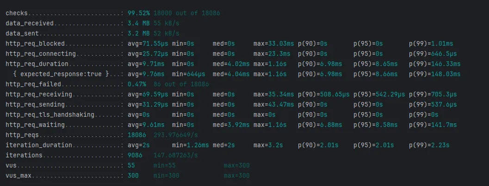

# 부하 테스트 보고서

### 개요 (목적)

서비스 인프라 구성을 위해 부하 테스트를 진행해보고 안정적으로 서비스를 운영할 수 있는 인프라 환경을 도출해보고자 합니다.

현재 서비스는 100명씩 제한하여 토큰을 활성하여 진행하기 때문에, 부하는 토큰 발급 및 조회 로직에 부하가 생길 것으로 판단하여 두 api 에 대해 진행하였습니다.

### 목표

- 동시 사용자 300명이 1분 동안 요청, 99% 요청을 성공하고 200ms 미만으로 유지

### **테스트 대상 인프라 구성**

| 케이스 | EC2 인스턴스 | Redis | MySQL |
| --- | --- | --- | --- |
| A | t3.micro (2 vCPU, 1GB) | cache.t3.micro (2 vCPU, 0.5GB) | db.t3.micro (2 vCPU, 1GB) |
| B | t3.medium (2 vCPU, 4GB) | cache.m5.large (2 vCPU, 6.42GB) | db.m5.large (2 vCPU, 8GB) |
| C | c5.large (2 vCPU, 4GB) | cache.r6g.large (2 vCPU, 13GB) | db.r6g.large (2 vCPU, 16GB) |

### 케이스 A 구성

- 부하 테스트 결과

### 케이스 B 구성

- 부하 테스트 결과

### 케이스 C 구성

- 부하테스트 결과

---

### 결과 비교

| 케이스 | 요청 성공률 | 99% 응답 시간  |
| --- | --- | --- |
| **A (t3.micro)** | 99.08% | 2.65s |
| **B (t3.medium)** | 99.70% | 193.92ms  |
| **C (c5.large)** | 99.52% | 148.03ms  |

케이스 B의 구성으로만 환경을 구성해도 목표한 성능을 지원할 수 있을 것으로 보이나, 사용자 수가 예상치 못하게 증가할 경우를 대비하여 케이스 C의 구성을 선택하는 것이 적절할 것으로 판단됩니다.